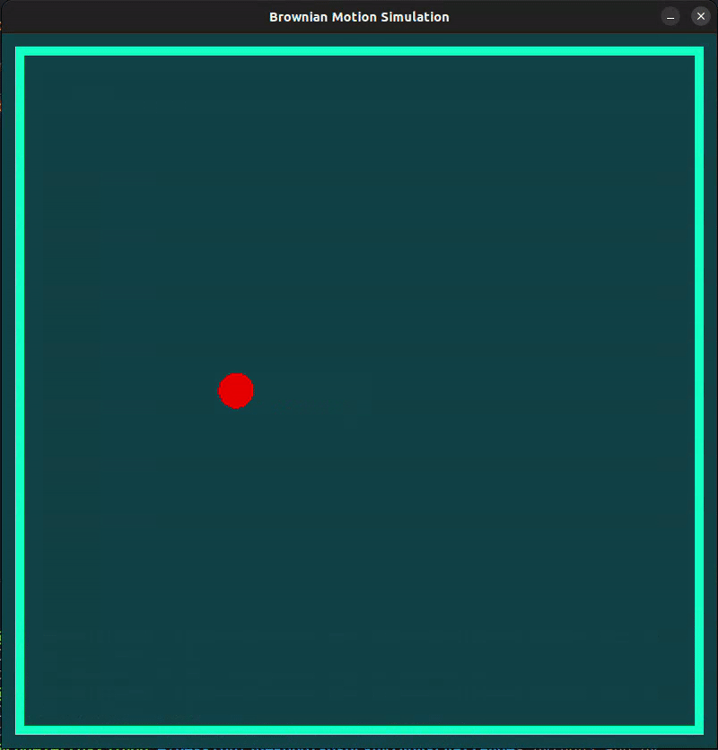

<div align="center">

  <h3 align="center">JdeRobot - Python Challenge</h3>

  <p align="center">
  JdeRobot GSOC-2023 Python Challenge
  </br>
  <a href="https://youtu.be/BEPQ1uBBd5w" target="_blank">Youtube - Demo Video</a>

  </p>
</div>

<!-- ABOUT THE PROJECT -->

## Demo

<div align="center">gif</div>



<div align="center">video</div>

<iframe width="560" height="315" src="https://www.youtube.com/embed/BEPQ1uBBd5w" title="YouTube video player" frameborder="0" allow="accelerometer; autoplay; clipboard-write; encrypted-media; gyroscope; picture-in-picture; web-share" allowfullscreen></iframe>
<!-- GETTING STARTED -->

## Getting Started

#### Installation Process

1. Clone the repo
    ```sh
    git clone https://github.com/codezerro/JdeRobot-gsoc-2023-python-challenge.git
    ```
2. Create python environment
    ```python
    python3 -m venv env
    ```
3. Active the environment
    ```python
    source env/bin/activate
    ```
4. Install package
    ```python
    pip install pygame
    ```
5. Run the app
    ```python
    python3 app.py
    ```

<!-- CONTACT -->

## Contact

Md.Shariar Kabir - [@linkedin](https://www.linkedin.com/in/md-shariar-kabir-238171160/)
